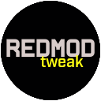
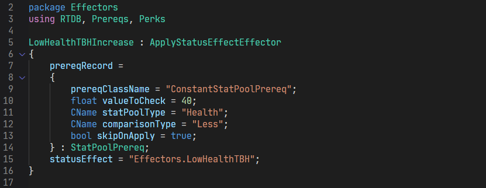

# REDmodTweak

VSCode syntax highlighting for [REDmod](https://www.cyberpunk.net/en/modding-support) `'.tweak'` files.

Hastily cobbled together from scratch; partially with ❤️. 

## Installation

Install directly from VSCode's Extension Manager or via the [Marketplace](https://marketplace.visualstudio.com/items?itemName=alternaut-dev.redmodtweak-lang) page.

## Known Issues

This extension was tested using VSCode's `Dark+ (default theme)` theme. The scope-names used may produce undesired results in a different theme, or have have no effect at all.

